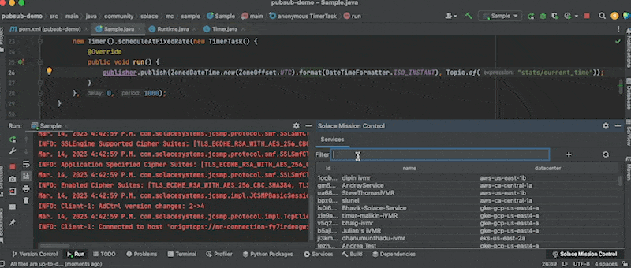
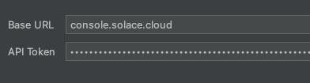

# Solace PubSub+ Mission Control Plugin for IntelliJ IDEA

<!-- Plugin description -->
Leverage the power of [Solace's Mission Control](https://solace.com/products/event-broker/cloud/mission-control/) right from IntelliJ.
<!-- Plugin description end -->

## Features
* Create event broker services
* Delete event broker services
* View event broker services
* Publish and subscribe to an event broker service

## Usage
* Create a [Solace Cloud API token](https://docs.solace.com/Cloud/ght_api_tokens.htm?Highlight=api%20tokens#Create) with the following permissions (either the "My Services" or "Organizational Services" variants):
  * Get Services
  * (Optional) Create Services
  * (Optional) Delete Services
* Enter the API token in the plugin settings: `Settings/Preferences`>`Tools`>`Solace Mission Control` 
* (Optional) If you use SSO, specify the URL you use to access Solace Cloud
## Resources
This is not an officially supported Solace product.

For more information try these resources:
- Ask the [Solace Community](https://solace.community)
- The Solace Developer Portal website at: https://solace.dev

## Contributing
Contributions are encouraged! Please read [CONTRIBUTING.md](CONTRIBUTING.md) for details on our code of conduct, and the process for submitting pull requests to us.

## Authors
See the list of [contributors](https://github.com/solacecommunity/<github-repo>/graphs/contributors) who participated in this project.

## License
See the [LICENSE](LICENSE) file for details.